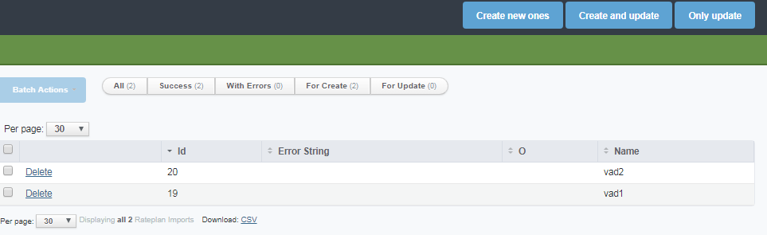

.. _data_import_export:

============================
Import & Export Data in Yeti
============================

Import & Export Data in Yeti are useful tools for organizing transparent migration from/to an alternative software platform.

Export
~~~~~~

Export of data in Yeti is available from any :ref:`List of Objects <type_of_controls-listofobjects>` control.
You can download all data from the table in the comma-separated values format by clicking on **CSV** link that is usually located at the bottom scrolling line together with information about general amount of objects that were displayed in the :ref:`List of Objects <type_of_controls-listofobjects>` control.

Import: General principles
~~~~~~~~~~~~~~~~~~~~~~~~~~

Import of data in Yeti is available from Working Areas (by pressing *Import* button that is placed on *General management line*) of following sections:

    -   :ref:`Contractors <contractors>`;
    -   :ref:`Accounts <accounts>`;
    -   :ref:`Gateway Groups <gateway_groups>`;
    -   :ref:`Gateways <gateways>`;
    -   :ref:`Disconnect Policies <disconnect_policy>`;
    -   :ref:`Equipment Registrations <registrations>`;
    -   :ref:`Customer Auths <customer_auth>`;
    -   :ref:`Rateplans <rateplans>`;
    -   :ref:`Destinations <destinations>`;
    -   :ref:`Routing Groups <routing_group>`;
    -   :ref:`Dialpeers <dialpeers>`;
    -   :ref:`Numberlists <numberlists>`;
    -   :ref:`Numberlists items <numberlist_items>`.

:ref:`Form for entering information <type_of_controls-formforentering>` for Import of data consists from two sections: *CSV options* and *Import*.

*CSV options* includes three textual input fields:

    -   *Col sep*    -  character (or string) that is used to separate columns within the importing CSV (comma-separated values) file. For example comma (,) could be used as *Col sep* value. In this case following text: "1,2,3" will be imported as values of three different columns (first column - 1,  second column - 2, third column - 3);
    -   *Row sep*    -  character (or string) that is used to separate rows within the importing CSV (comma-separated values) file;
    -   *Quote char* -  character (or string) that is used to limit some values within the importing CSV (comma-separated values) file. These characters will be removed during the import process and values without these characters will be imported.

*Import* includes following controls:

    -   *File*  -   button for opening standard system "Open" dialog for choosing file for importing (not limited by .csv extension);
    -   *Script*    -   single-record selection list for choosing special pre-loaded into Yeti script for importing files with using special rules;
    -   *Unique columns values*     -   set of True/False checkboxes that are used for choosing field names that will be controlled during the import process: values in these fields should be unique for current importing session.

After the filling of form that is described above and pressing *Import* button you will be redirected to the list of imported records. See example below.

.. note:: You should finish previous importing process before you can start import of other type objects.

Future actions with list of imported records are possible via following set of buttons on Working Area (these buttons are placed on *General management line*):

       -      *Create new ones* -  Will create new records in the main Database on the basis of selected records in the list of imported records. In case of selecting records that are already available in the main Database (have same ids) these records will be ignored by importing procedure;
       -      *Create and update*  - Will create new records in the main Database on the basis of selected records in the list of imported records. In case of selecting records that are already available in the main Database (have same ids) these records will be updated with new (imported) information by importing procedure;
       -      *Only update* - Will update all existing in the main Database records with new (imported) information by importing procedure. In case of selecting records that are not presented in the main Database these records will be ignored.

Export & Import: Format of the fields for different objects
~~~~~~~~~~~~~~~~~~~~~~~~~~~~~~~~~~~~~~~~~~~~~~~~~~~~~~~~~~~

**TODO**